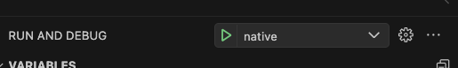

# Installation

This is the guide for how to setup the Local platform. If there are questions or mistakes please open an issue or pull request.

## Requirements

Here are the base requirements. Docker and NodeJS aren't necessary as we haven't started work on those aspects.

- [Flutter](https://docs.flutter.dev/get-started/install/macos)
- [Golang](https://go.dev/doc/install)
- [Docker](https://docs.docker.com/engine/install/)
- [NodeJS](https://nodejs.org/en/download)

## Development Environment

I would recommend VS Code, but you could use nvim or any other tool. The configuration for VS Code is shared in the github repostiory.

- Plugins
  - [Bloc](https://marketplace.visualstudio.com/items?itemName=FelixAngelov.bloc)
  - [Flutter](https://marketplace.visualstudio.com/items?itemName=Dart-Code.flutter)
  - [Dart](https://marketplace.visualstudio.com/items?itemName=Dart-Code.dart-code)
  - [Go](https://marketplace.visualstudio.com/items?itemName=golang.Go)

## Setup

1.  `git clone https://github.com/joinpickup/platform.git`
2.  Setup platform-server

    - `cd code/server`
    - `go mod tidy`
    - We need to expose the service dependent on how we are going to be interfacing with it.
      - Using Personal Iphone for platform-native
        - `go run main.go serve --http "$(ipconfig getifaddr en0):8090"`
      - Everything else
        - `go run main.go serve`
    - Now that it's run we can follow the instructions from the CLI.
      - We want to go here for the admin portal
        - `http://127.0.0.1:8090/_/`
      - it's going to ask for a username and password, this is the test account
        - `username: admin@joinpickup.com`
        - `password: btv-HKV8tej5upb4anq`
      - if you can connect at this point, the backend is setup
      - note: this will have all of the local data. I've checked in the db that i've been using locally. let's keep doing that so that we have updated test data.

3.  Setup platform-native

    - `cd code/native`
    - need to create the environment variable to point to the backend
      - for Iphone
      - `echo "API_ENDPOINT=http://$(ipconfig getifaddr en0):8090" > .env`
      - for Simulator
      - `echo "API_ENDPOINT=http://127.0.0.1:8090" > .env`
    - from VS Code

      - open the command pallete and type `select device`
        
      - select the IOS Simulator or youre Iphone
      - then in the Run and Debug make sure `native` is selected click run
        
      - assuming you've configured flutter properly this should start the application on the device

    - from the command line
      - `flutter run`
